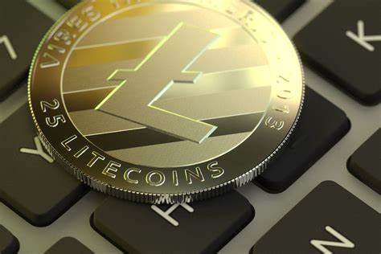
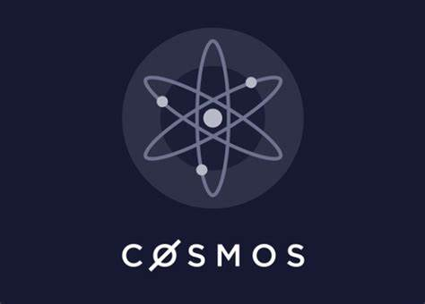

# Chillin' With Crypto

---
## Team Members
* Abidemi Oladoja
* Daniel Budhram
* Nelson Lubinda
---
# Project Outline
#### Our project aims to look at three cryptocurrencies that we believe could rival Bitcoin and Ethereum as long term investments. We all know the cryptocurrency market is all the rage right now but all you really hear about is Bitcoin and Ethereum. We wanted to look at 3 coins we believe could possibly challenge their trends in the future. 
We can't measure Fear and Greed... But we can look at data trends! Cryptocurrency investors should take a price prediction with a good degree of skepticism. One of the major problems with many price predictions about bitcoin is that they lack sufficient analytical support to back up their claims. Some prominent figures in the industry who push for sky-high prices are doing so for reasons that may not be linked to fundamentals.

---
# Research Questions
1. Are these coins worth investing in?
2. Will they be sustainable or will they die out in the next 5, 10, 15, 30 years?
3. How will they perform against major cryptocoins like Bitcoin and Ethereum?
4. What is the correlation between S&P500 and Bitcoin?
---
# Cryptocurrencies We Looked At
## Bitcoin
A peer to peer currency can be used for any transaction. It holds the distinction for being the first ever successful cryptocurrency ever used. The found who is not known but goes by Satoshi Nakamoto launched it in 2009. It has a market cap of $692 billion and it the most popular on the market

## Ethereum
An open source blockchain that works as platform for other cryptocurrencies mainly for smart contracts. It also has its own cryptocurrency called Ether. It was established in 2013 by Vitalik Buterin. It has a market cap of $305 billion and is the 2nd most popular crypto among investors.

## Litecoin
This cryptocurrency operates the same way as the Bitcoin does and is the 2nd popular choice among those who use crypto for peer to peer transaction. It was created by Charlie Lee who was once employed by Google. The market cap for this coin is $7.6 billion.

## Cosmos
Cosmos calls itself a project that aims to solve some of the hardest problems facing the blockchain industry. This crypto plans on solving all blockchain problems dealing with scalability, efficiency, and a negative environmental impact. Co-founders Jae Kwon, Ethan Buchman, and Zarko Milosevic have high hopes this project will take off. The market cap for Cosmos is $8.4 billion. 

## Solana
Solana is an open source project that uses blockchain technology's permissionless nature to provide decentralized finance solutions. The idea of this crypto started in 2017 by Anatoly Yakovenko and launched in 2020 by the Solana Foundation. The current market cap for Solana is $28 billion. 

---
## Datasets 
We implemented the use of Yahoo Finance through pandareader, google finance, alpacas. Panda reader was free and easy to use to pull the data we needed for this project. Google Finance provided us the best data for the S&P500 with easy conversion to csv file. Alpaca was perfect to run monte carlo simulations. Data sources were in json format so they were easy to convert into panda dataframes.

---
## Citations
--- 
[CoinMarketCap](https://coinmarketcap.com/) 

[Alpaca API](https://app.alpaca.markets/brokerage/new-account/overview)

[Rutgers Coding Bootcamp](https://github.com/RutgersCodingBootcamp)

